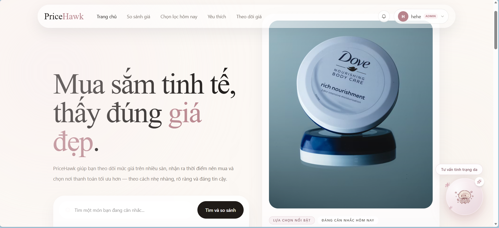
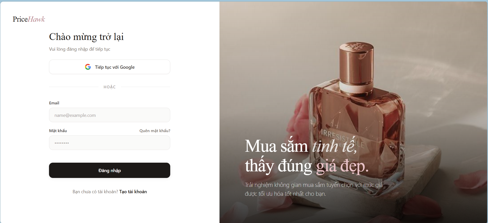
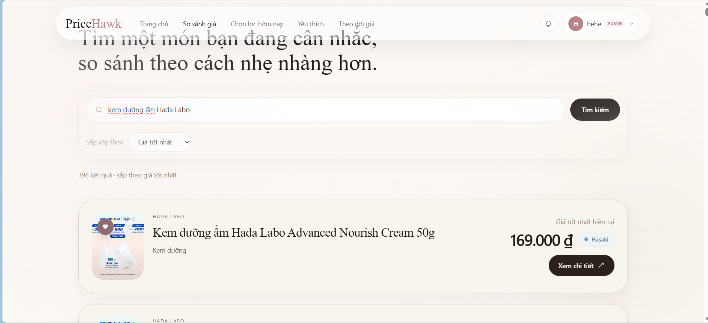
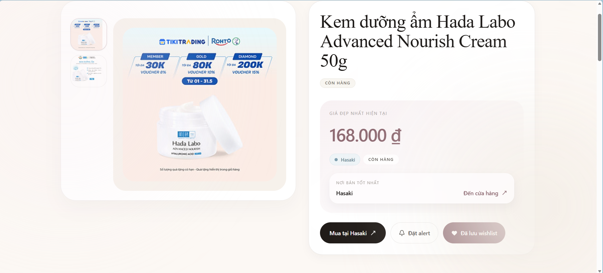
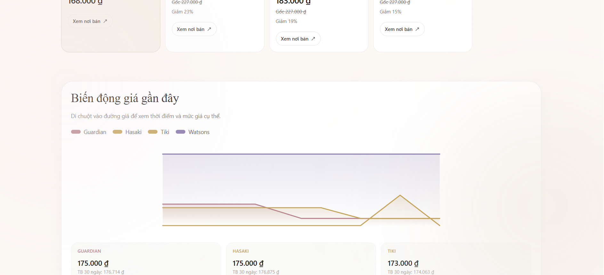
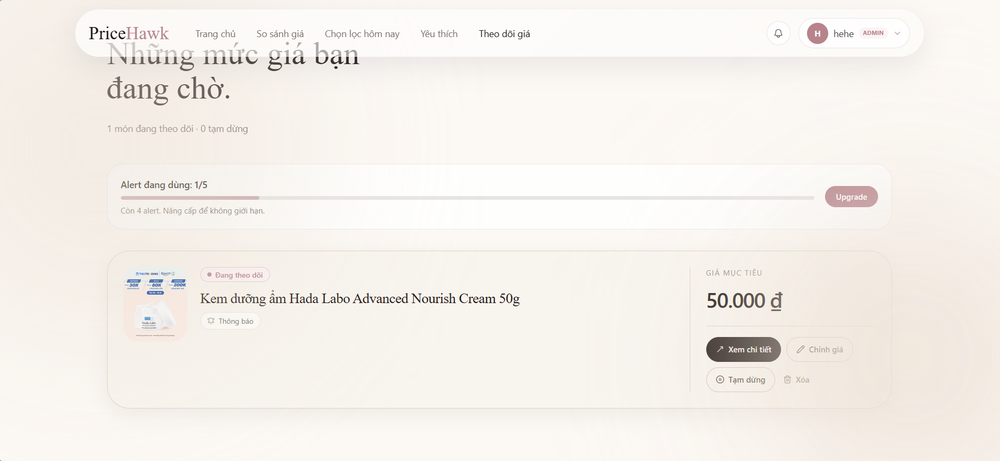
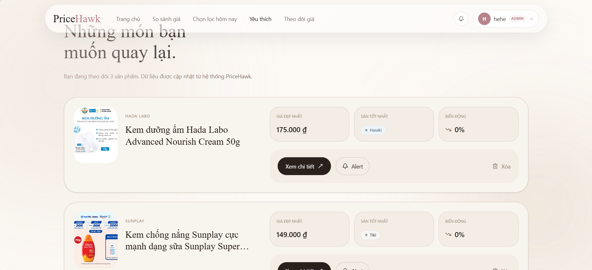
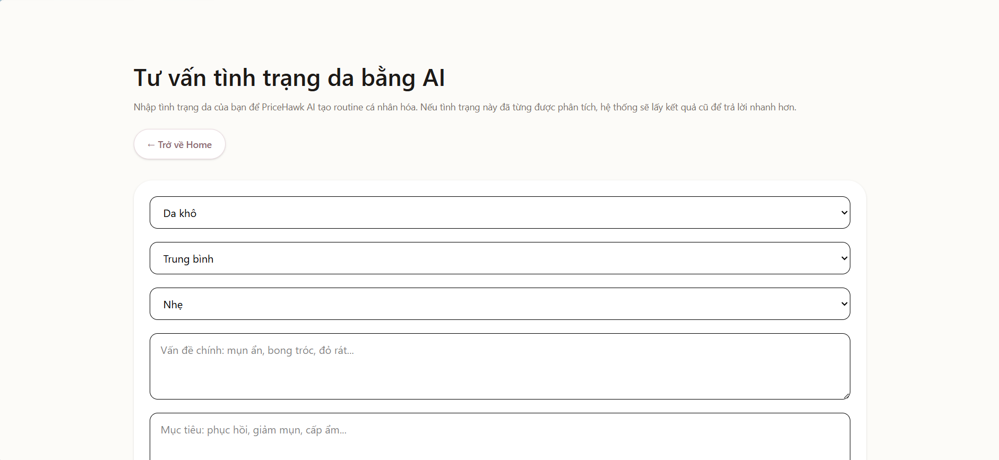
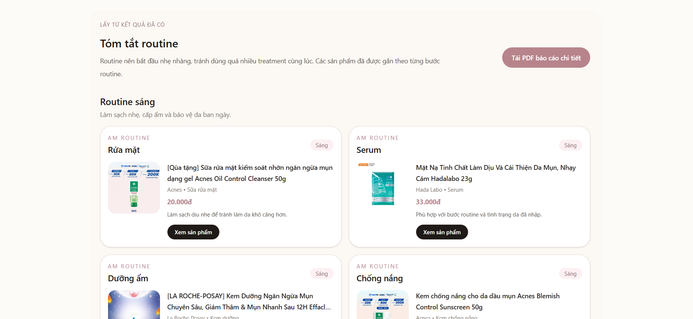
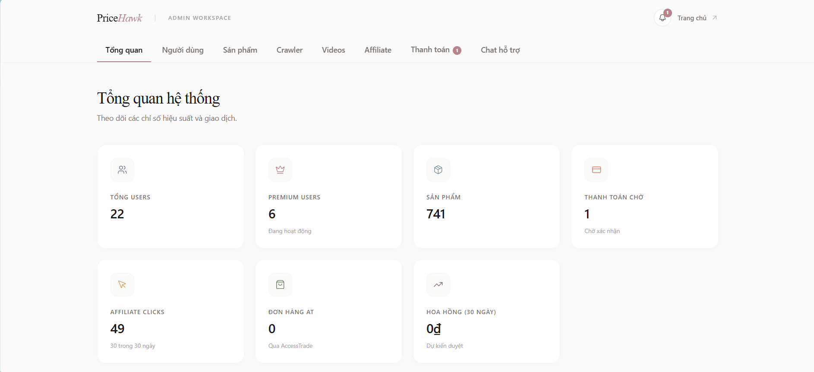

# PriceHawk — Nền tảng So sánh Giá Sản phẩm Làm đẹp

> So sánh giá realtime · Phát hiện deal ảo · Tư vấn mua sắm bằng AI



---

## Mục lục

- [Giới thiệu](#giới-thiệu)
- [Tính năng](#tính-năng)
- [Kiến trúc hệ thống](#kiến-trúc-hệ-thống)
- [Tech Stack](#tech-stack)
- [Cài đặt & Chạy local](#cài-đặt--chạy-local)
- [Biến môi trường](#biến-môi-trường)
- [Monitoring](#monitoring)
- [Thành viên](#thành-viên)

---

## Giới thiệu

**PriceHawk** là nền tảng so sánh giá và tư vấn mua sắm thông minh dành cho ngành làm đẹp tại Việt Nam. Hệ thống tự động thu thập giá từ 5 sàn thương mại điện tử lớn, phát hiện khuyến mãi ảo, gợi ý sản phẩm phù hợp với loại da của người dùng, và gửi cảnh báo giá tự động qua email.



---

## Tính năng

### Tìm kiếm sản phẩm
- Tìm kiếm full-text qua Elasticsearch, hỗ trợ tiếng Việt
- Lọc theo danh mục, thương hiệu, khoảng giá
- Gợi ý sản phẩm liên quan



### So sánh giá & Lịch sử giá
- Thu thập giá realtime từ **Tiki, Hasaki, Guardian, Cocolux, Watsons**
- Hiển thị lịch sử giá dạng biểu đồ theo thời gian
- Tự động làm mới giá theo lịch (mỗi 15 phút)





### Phát hiện Deal thông minh
- Tính **Deal Score** = `0.55 × Discount + 0.25 × Trust + 0.20 × Freshness`
- Gắn nhãn **HOT** (giảm >30%), **DEAL** (giảm >20%)
- Phát hiện khuyến mãi ảo (giá gốc bị thổi phồng, giảm >72%)


### Cảnh báo giá
- Người dùng đặt mục tiêu giá cho từng sản phẩm
- Hệ thống gửi email tự động (qua Resend API) khi giá về đúng ngưỡng
- Gói Free: 5 cảnh báo · Gói Premium: không giới hạn



### Wishlist
- Lưu sản phẩm yêu thích để theo dõi giá
- Gợi ý sản phẩm tương tự dựa trên wishlist



### AI Chatbot tư vấn mua sắm
- Tích hợp **Google Gemini 2.5 Flash** — phản hồi streaming realtime (SSE)
- Hiểu ngữ cảnh sản phẩm, tìm kiếm giá, đề xuất deal đang hot
- Hỗ trợ tiếng Việt và tiếng Anh


### Phân tích da & Tư vấn sản phẩm
- Bộ câu hỏi xác định loại da (da dầu, da khô, da hỗn hợp, da nhạy cảm)
- Gợi ý sản phẩm phù hợp, lọc theo loại da
- Xuất báo cáo phân tích dạng **PDF**





### Admin Dashboard
- Quản lý người dùng, sản phẩm, đơn thanh toán, affiliate, crawler
- Xác minh thanh toán thủ công
- Kích hoạt crawl giá theo yêu cầu (on-demand)



### Chrome Extension
- Overlay so sánh giá ngay trên trang sản phẩm của các sàn
- Không cần chuyển sang tab khác
- Đồng bộ session với tài khoản PriceHawk

### Thanh toán Premium
- Thanh toán qua chuyển khoản ngân hàng / QR code
- Admin xác minh và kích hoạt gói thủ công
- Quản lý ngày hết hạn gói Premium

---

## Kiến trúc hệ thống

```
┌─────────────────────────────────────────────────────┐
│                   Client Layer                       │
│        React SPA (Web)  +  Chrome Extension         │
└────────────────────┬────────────────────────────────┘
                     │ REST / WebSocket / SSE
┌────────────────────▼────────────────────────────────┐
│              Spring Boot Backend (8080)              │
│  Controllers → Services → Repositories              │
│  Scheduler (15m price refresh) · Async Crawlers     │
└──────┬──────────┬──────────┬──────────┬─────────────┘
       │          │          │          │
  PostgreSQL   Redis     Elasticsearch  External APIs
 (Supabase)  (Cache /   (Full-text     (Gemini, Resend,
             Queue)      search)        AccessTrade,
                                        Tiki/Hasaki/...)
```

---

## Tech Stack

| Layer | Công nghệ |
|---|---|
| **Backend** | Java 17, Spring Boot 3.3.5, Spring Security, Spring WebSocket |
| **Frontend** | React 19, TypeScript, Vite 8, Tailwind CSS 4, React Router v7 |
| **Database** | PostgreSQL (Supabase cloud), Flyway migration |
| **Search** | Elasticsearch |
| **Cache / Queue** | Redis |
| **Auth** | Supabase Auth, JWT (ES256) |
| **AI** | Google Gemini 2.5 Flash API |
| **Email** | Resend API |
| **Affiliate** | AccessTrade API |
| **PDF** | OpenPDF |
| **Container** | Docker, Docker Compose |
| **Monitoring** | Prometheus, Grafana, Blackbox Exporter, Node Exporter |
| **CI/CD** | GitHub Actions (security scan: Semgrep) |
| **Extension** | Chrome Extension Manifest V3 |

---

## Cài đặt & Chạy local

### Yêu cầu
- Docker & Docker Compose
- Node.js 20+ (cho data scripts)
- Java 17+ (nếu chạy backend riêng)

### Chạy toàn bộ stack với Docker Compose

```bash
# Clone repo
git clone <repo-url>
cd pricehawk

# Tạo file env
cp .env.example .env
# Điền các biến môi trường (xem phần bên dưới)

# Build & chạy
docker compose up --build
```

- Frontend: http://localhost:80
- Backend API: http://localhost:8080

### Chạy Backend riêng

```bash
cd backend
./mvnw spring-boot:run
```

### Chạy Frontend riêng

```bash
cd frontend
npm install
npm run dev
```

---

## Biến môi trường

Tạo file `.env` ở root hoặc export trực tiếp:

```env
# Database (Supabase)
SUPABASE_URL=https://<project-id>.supabase.co
SUPABASE_API_KEY=<supabase-anon-key>

# Redis
REDIS_HOST=localhost
REDIS_PORT=6379

# Elasticsearch
ELASTICSEARCH_URI=http://localhost:9200

# AI (Google Gemini)
AI_API_KEY=<gemini-api-key>
AI_MODEL=gemini-2.5-flash

# Email
RESEND_API_KEY=<resend-api-key>

# Affiliate
ACCESSTRADE_API_KEY=<accesstrade-api-key>

# Crawler scripts
WATSONS_SCRIPT=backend/watsons-price.js
COCOLUX_SCRIPT=backend/cocolux-price.js

# Scheduler (tắt khi dev local)
PRICE_REFRESH_SCHEDULER_ENABLED=false
```

---

## Monitoring

Stack monitoring chạy tách biệt:

```bash
cd monitoring
docker compose up -d
```

| Service | URL |
|---|---|
| Grafana | http://localhost:3000 |
| Prometheus | http://localhost:9090 |
| Spring Actuator | http://localhost:8080/actuator/prometheus |

---

## Cấu trúc thư mục

```
pricehawk/
├── backend/                  # Spring Boot application
│   ├── src/main/java/com/pricehawl/
│   │   ├── controller/       # REST & WebSocket controllers
│   │   ├── service/          # Business logic, crawlers, AI
│   │   ├── repository/       # JPA & Elasticsearch repos
│   │   └── entity/           # JPA entities
│   └── src/main/resources/
│       ├── application.yml
│       └── db/migration/     # Flyway SQL scripts
├── frontend/                 # React SPA
│   └── src/
│       ├── pages/            # Route-level pages
│       ├── components/       # Reusable UI components
│       ├── service/          # API client services
│       └── context/          # Auth & Wishlist context
├── pricehawk-extension-v1/   # Chrome Extension (MV3)
├── monitoring/               # Prometheus + Grafana stack
├── data-processor/           # Node.js data pipeline scripts
└── docker-compose.yml
```

---


